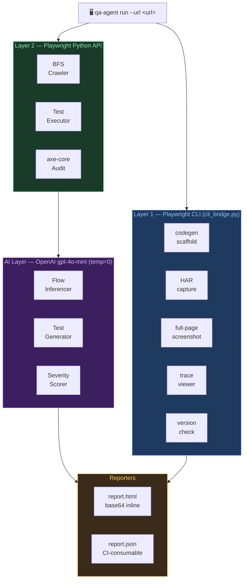
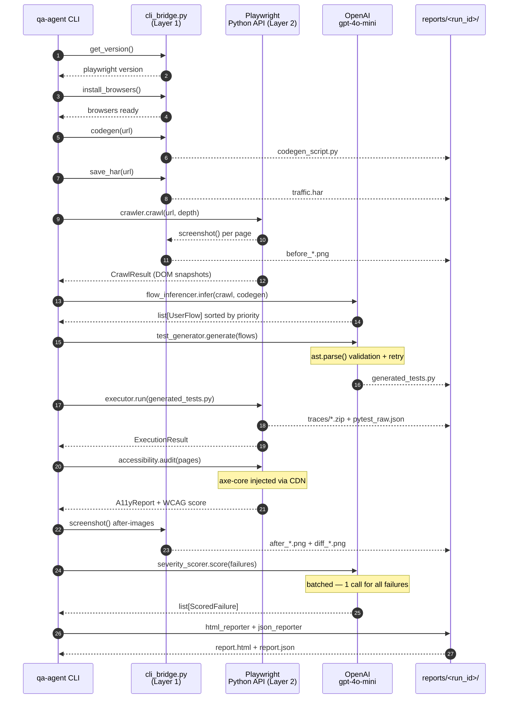

# AutonomousQA Agent

> Zero-config AI-powered web testing: give it a URL, get a full QA report.

[](https://github.com/iklymchuk/autonomous-qa-agent/actions/workflows/ci.yml)
[](https://codecov.io/gh/iklymchuk/autonomous-qa-agent)
[](https://www.python.org/downloads/)
[](https://playwright.dev/)
[](https://platform.openai.com/)
[](LICENSE)

---

## What it does

AutonomousQA Agent is a production-grade autonomous QA platform that requires **zero human-written test scripts**. Given only a URL, it:

- 🕷️ **Crawls** the web app with a BFS Playwright browser, extracting full DOM snapshots
- 🧠 **Infers** realistic user flows using GPT-4o-mini from DOM structure + codegen context
- ⚙️ **Generates** executable Playwright pytest files with Page Object Model — dynamically
- ▶️ **Executes** the generated tests and captures Playwright traces per test
- ♿ **Audits** accessibility with axe-core injection (WCAG 2.1 AA score)
- 🖼️ **Diffs** before/after screenshots at the pixel level with Pillow
- 🔴 **Classifies** failures by business severity (CRITICAL / HIGH / MEDIUM / LOW) via AI
- 📊 **Reports** everything in a self-contained HTML + JSON report

No test scripts are written by humans. The agent does it all.

---

## Quick Start

```bash
git clone https://github.com/iklymchuk/autonomous-qa-agent.git
cd autonomous-qa-agent

make install
make install-browsers

cp .env.example .env
# → add your OPENAI_API_KEY

make demo
```

---

## Architecture

### Two-layer Playwright strategy

The platform uses a deliberate two-layer design. CLI for portable artifacts; Python API for intelligent automation.



### Full agent run — step by step



---

## Agent Steps

| # | Layer | Module | Output |
|---|-------|--------|--------|
| 1 | CLI | `cli_bridge.get_version()` | Playwright version string |
| 2 | CLI | `cli_bridge.install_browsers()` | Verified browser installations |
| 3 | CLI | `cli_bridge.codegen()` | `codegen_script.py` |
| 4 | CLI | `cli_bridge.save_har()` | `traffic.har` |
| 5 | Python API | `crawler.crawl()` | `CrawlResult` with DOM snapshots |
| 6 | AI | `flow_inferencer.infer()` | `list[UserFlow]` sorted by priority |
| 7 | AI | `test_generator.generate()` | `generated_tests.py` |
| 8 | CLI + API | `executor.run()` | `ExecutionResult` |
| 9 | Python API | `accessibility.audit()` | `A11yReport` + WCAG score |
| 10 | CLI | `visual_diff.diff()` | Before/after/diff PNGs |
| 11 | AI | `severity_scorer.score()` | `list[ScoredFailure]` |
| 12 | Python | `html_reporter + json_reporter` | `report.html` + `report.json` |
| 13 | CLI | `cli_bridge.show_trace()` | Trace viewer (if `--interactive`) |

---

## CLI Usage

### Full agent run

```bash
qa-agent run --url https://example.com
qa-agent run --url https://example.com --depth 5 --browsers chromium,firefox
qa-agent run --url https://example.com --visual-diff
qa-agent run --url https://example.com --headed --interactive
```

| Flag | Default | Description |
|------|---------|-------------|
| `--url` | required | Target web app URL |
| `--depth` | `3` | BFS crawl depth |
| `--browsers` | `chromium` | Comma-separated: `chromium,firefox,webkit` |
| `--headed` | off | Run in headed (visible) browser mode |
| `--no-a11y` | off | Disable axe-core WCAG audit |
| `--visual-diff` | off | Capture before/after screenshots + pixel diff |
| `--interactive` | off | Open Playwright trace viewer on failure |
| `--log-level` | `INFO` | `DEBUG` / `INFO` / `WARNING` / `ERROR` |

### Other commands

```bash
# Record a codegen session to explore a site manually
qa-agent codegen http://localhost:5000

# Capture a full-page screenshot
qa-agent screenshot https://example.com --output screen.png

# Open the most recent report in browser
qa-agent report --last

# List all saved reports with pass rates
qa-agent report --list

# Delete all report directories (with confirmation prompt)
qa-agent clean

# Install Playwright browsers
qa-agent install-browsers
```

---

## Demo output

```
┌───────────────────────────────────────────────────────-──┐
│ QA Run Summary — run_20240115_143022                     │
├──────────────────────────┬───────────────────────────-───┤
│ URL                      │ http://localhost:5000         │
│ Duration                 │ 47.2s                         │
│ Pages Crawled            │ 6                             │
│ Flows Inferred           │ 5                             │
│ Tests Run                │ 5                             │
│ Passed                   │ 4                             │
│ Failed                   │ 1                             │
│ Pass Rate                │ 80.0%                         │
│ Severity                 │ CRITICAL:0 HIGH:1 MEDIUM:0    │
│ WCAG Score               │ 85/100                        │
└──────────────────────────┴───────────────────────────-───┘

✓ Report saved to: reports/run_20240115_143022/report.html
✓ JSON saved to:   reports/run_20240115_143022/report.json
```

---

## Report structure

```
reports/
└── run_20240115_143022/
    ├── report.html          # Self-contained HTML (base64 images, no external deps)
    ├── report.json          # CI-consumable JSON summary
    ├── generated_tests.py   # AI-generated test code (auditable)
    ├── codegen_script.py    # Raw playwright codegen output
    ├── traffic.har          # Full HAR from CLI capture
    ├── pytest_raw.json      # Raw pytest-json-report output
    ├── visual/
    │   ├── before_*.png     # Screenshots before tests
    │   ├── after_*.png      # Screenshots after tests
    │   └── diff_*.png       # Pixel diff (changed pixels highlighted)
    └── traces/
        └── test_*.zip       # Playwright trace per test
```

`report.html` is fully self-contained — all screenshots are base64-encoded inline. Safe to email, archive, or open offline.

---

## Design Decisions

### 1. Two-layer Playwright: CLI + Python API

Playwright's CLI and Python API serve fundamentally different purposes. The CLI produces **portable artifacts** (HAR files, codegen scaffolds, screenshots, traces) that are inspectable by humans and composable in shell scripts — ideal for CI artifact capture. The Python async API provides **programmatic control** needed for BFS traversal, dynamic DOM evaluation, and axe-core injection. Conflating the two leads to fragile automation. By strictly routing artifact capture through `cli_bridge.py` and automation logic through the Python API, each layer does what it was designed for.

### 2. BFS crawling with same-origin enforcement

BFS guarantees shallow, high-value pages (home, login, dashboard) are always discovered before deep link trees, regardless of navigation graph shape. DFS risks thrashing inside a deep subtree and never reaching important pages. Same-origin enforcement prevents the crawler from wandering into CDNs, OAuth providers, or analytics services that are irrelevant to the app under test.

### 3. Codegen scaffold as AI context

`playwright codegen` records actual human interactions in a live browser session. Passing this alongside DOM snapshots gives the model evidence of realistic patterns — which elements a real user clicks, what data they type, which pages matter. Without it, the model infers flows purely from static structure, producing generic low-value tests.

### 4. Page Object Model in generated tests

POM separates selector maintenance from test logic. AI-generated POM classes (`LoginPage`, `DashboardPage`) produce code that human engineers can read, review, and maintain. Raw tests with inline selectors scattered across functions are fragile and unauditable.

### 5. `ast.parse()` validation before test execution

LLMs occasionally produce syntactically broken Python. `ast.parse()` catches this in < 1 ms before a confusing pytest import error surfaces. The retry loop gives the model the exact syntax error message, dramatically increasing second-attempt success rates. If both attempts fail, a `.broken` file is saved for debugging and a valid skip-test placeholder keeps the pipeline running.

### 6. Batched AI calls for severity scoring

One API call per failure multiplies latency and cost linearly. A single batched call lets the model assess all failures comparatively — identifying whether multiple failures share a root cause (e.g., all failing on the same broken page) vs. isolated issues. This produces more consistent and contextually aware severity ratings.

### 7. Base64-inline images in HTML report

File-path-based reports break when moved, archived, or emailed. Encoding all screenshots as base64 data URIs makes `report.html` a single portable artifact — the same approach used by Allure and Playwright's own HTML reporter.

### 8. `temperature=0` for all AI calls

Deterministic outputs are essential in CI. `temperature=0` ensures the same codebase produces the same generated tests across runs, making genuine regressions distinguishable from random LLM variation. It also minimises hallucination, favouring syntactically correct, conventional Python over experimental output.

---

## Running tests

### Unit tests (no API key required)

```bash
make test
# or
poetry run pytest tests/unit/ -v
```

### With coverage

```bash
make coverage
# Opens htmlcov/index.html  (target: 80%+)
```

### Integration tests (requires `OPENAI_API_KEY`)

```bash
export OPENAI_API_KEY=sk-...
make test-integration
```

Integration tests are automatically skipped without a key:

```
SKIP tests/integration/test_full_agent_run.py::test_full_agent_run_creates_reports
  OPENAI_API_KEY not set — skipping integration tests
```

### Lint + type check

```bash
make lint       # ruff
make typecheck  # mypy
```

---

## Contributing

1. Fork the repository
2. Create a feature branch: `git checkout -b feature/my-feature`
3. Make changes and add tests
4. Run the full check suite: `make lint && make typecheck && make test`
5. Submit a pull request with a clear description

Coverage target: **80%+** (enforced in CI). All new modules require unit tests that mock external calls.

---

**Built with ❤️ by Ivan Klymchuk**